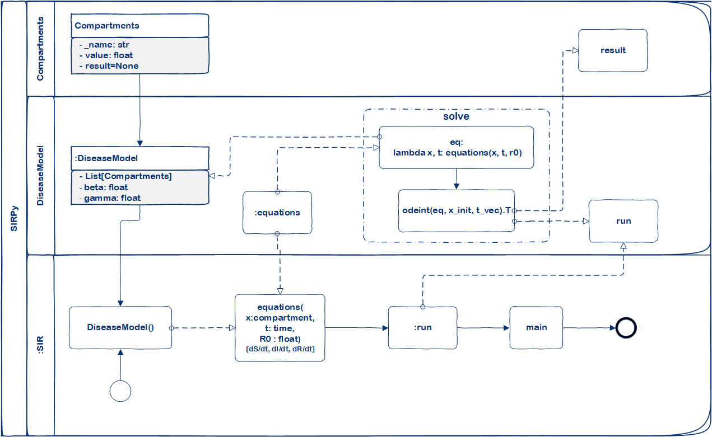

Epidemiology of infectious diseases in Python (EpilDPy)
=======================================================

# Quick Links

# Getting Started Using the Library
The Epidemiology of infectious diseases in Python (EpilDPy)is a framework 
designed to help scientists and public health officials create and 
use models of emerging infectious diseases. This framework uses 
mathematical models of diseases (based on differential equations) 
to simulate the development or evolution of a disease in time. 
Also, the framework is founded on an object-oriented approach in 
order to optimize the simulation processes of the models. 
The following illustrates and describes the process of creating a 
SIRPy type of model.

To create a new model, you must instantiate the base object 
DiseaseModel and implement the equations method and the main 
entry point main. For the function of the equation, the differential 
equations that the model represents are defined, for example:

In relation to the main function, the following activities must be carried out:
1.	Create the compartments that represent the model, defining instances of Compartments type objects, for example:
        susc = Compartments(name='susceptible')
        expo = Compartments(name='exposed')
        inf = Compartments(name='infectious')
        rec = Compartments(name='recovered')
2.	Then the compartments type objects are assigned to a list.

## Installation

EpilDPy requires Python 3.6.1 or later. The preferred way to install EpilDPy is via `pip`.  Just run `pip install EpilDPy` in your Python environment and you're good to go!

If you need pointers on setting up an appropriate Python environment or would like to install EpilDPy using a different method, see below.

We support EpilDPy on Windows, Mac and Linux environments.

## Team

- Edwin Puertas, Doctoral Research | Data and Computer Scientist <eapuerta@gmail.com>
- Angel Paternina-Caicedo, MD MSc <angel.paternina@gmail.com> 
- Center for Excellence and Appropriation in Big Data and Data Analytics (CAOBA) <http://alianzacaoba.co/>

## Support by

- Pontificia Universidad Javeriana <https://www.javeriana.edu.co/>
- Universidad del Sinú | Seccional Cartagena <https://www.unisinucartagena.edu.co/en/>
- Hospital Universitario San Ignacio <http://www.husi.org.co/inicio>

### Funded by

Minciencias | Ministerio de Ciencia Tecnología e Innovación