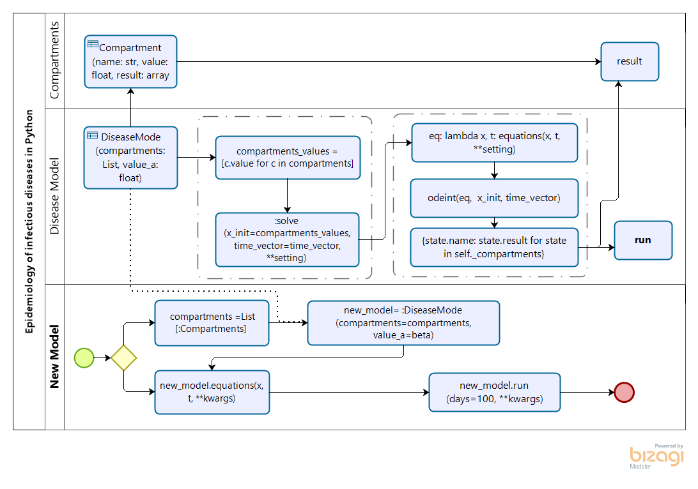
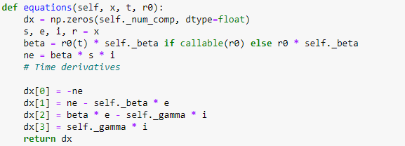

Epidemiology of infectious diseases in Python (EpilDPy)
=======================================================

# Quick Links

# Getting Started Using the Library
The Epidemiology of infectious diseases in Python (EpilDPy) is a framework designed to help scientists and 
public health officials create and use models of emerging infectious diseases. This framework uses 
mathematical models of diseases (based on differential equations) to simulate the development or 
evolution of a disease in time. Also, the framework is founded on an Object-Oriented Programing and 
Software design pattern approaches in order to optimize the simulation processes of the models. 
The following illustrates and describes the process of creating a EpilDPy type of model.

To create a new model, you must instantiate the base object DiseaseModel and implement 
the equations method and the main entry point main. To implement a new type model of **EpilDPy**, 
the following activities must be performed.

1.	Create the compartments that represent the model, defining instances of objects of type compartments, then assign 
the name and finally assign the initial value of the compartments for example: 
    `susc = Compartments(name='susceptible', value=0.0)` 
    `expo = Compartments(name='exposed', value=0.0)` 
    `inf = Compartments(name='infectious', value=0.0)` 
    `rec = Compartments(name='recovered', value=0.0)` 
2.	Add compartment objects to a list, for instance:  
    `compartments = [susc, expo, iinf, rec]`
3.	Import the general data associated with the equations calculations. For this they can use the load_json method 
in the Utils class, which imports a JSON-type data set. To carry out the import quickly and directly, you must place 
the file in the path "EpilDPy / data / input" and then call the function for example.  
            `Utils.load_json (file = ’file_name’)`
4.	The new model created is instantiated with the compartments list and three values such as value_a, value_b, value_c, 
which are used for the calculations of the equations because they are instance values by the **DiseaseModel** class. 
Regarding the default values, if you want to install them, you must assign them the value 0.0.  
    `ct = ContactTracing(compartments=compartments, value_a=GAMMA, value_b=BETA, value_c=0.0)`
5.	In order to define the equations of the corresponding model, the equation function must be implemented, 
which defines the differential equations that the model will calculate. For this activity it is recommended to use 
dictionaries to optimize the implementation of the equations. Here is an example of how you can implement 
the equation function with an example of a SIR model with four compartments.

6.	Finally, the result function must be executed with the parameters DAYS and R0. For example:  
    `resp = ct.result(days=DAYS, r0=R0)`
 The result function returns a dictionary of compartments with the respective matrices, after executing the process 
described above.

## Installation

EpilDPy requires Python 3.6.1 or later. The preferred way to install **EpilDPy** is via `pip`.  Just run `pip install EpilDPy` in your Python environment and you're good to go!

If you need pointers on setting up an appropriate Python environment or would like to install EpilDPy using a different method, see below.

We support EpilDPy on Windows, Mac and Linux environments.

## Team

- Edwin Puertas, Doctoral Research | Data and Computer Scientist <eapuerta@gmail.com>
- Angel Paternina-Caicedo, MD MSc <angel.paternina@gmail.com> 
- Center for Excellence and Appropriation in Big Data and Data Analytics (CAOBA) <http://alianzacaoba.co/>

## Support by

- Pontificia Universidad Javeriana <https://www.javeriana.edu.co/>
- Universidad del Sinú | Seccional Cartagena <https://www.unisinucartagena.edu.co/en/>
- Hospital Universitario San Ignacio <http://www.husi.org.co/inicio>

## Funded by

Minciencias | Ministerio de Ciencia Tecnología e Innovación

## Projects

- SEIR 
- Covid Economic Evaluation <https://alianzacaoba.github.io/EpiIDPy/#>
- Contact Tracing 